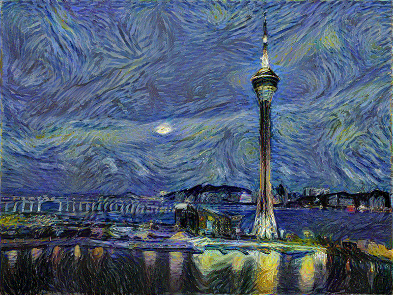
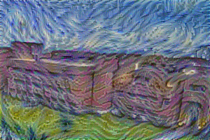
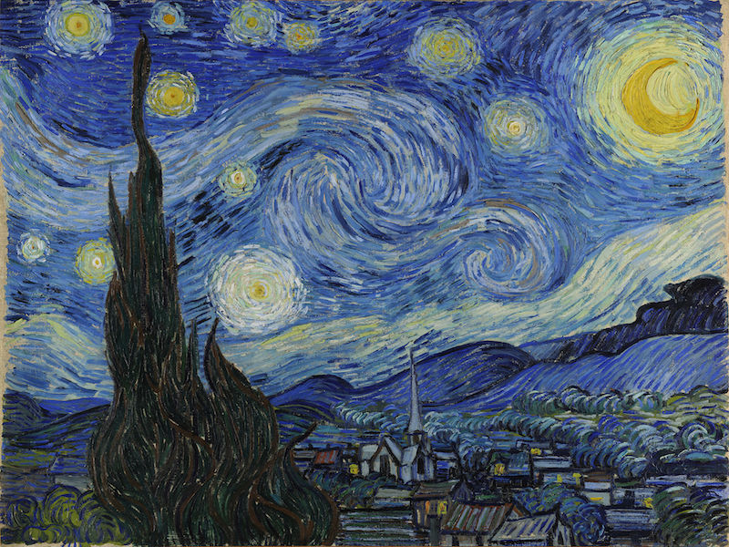

# Implementation of "A Neural Algorithm of Artistic Style"

Results:

Using the StarryNight:

# How to run

Dependencies:

- TensorFlow
- Scipy
- Numpy

You will need to download the [VGG-19 model](http://www.vlfeat.org/matconvnet/models/imagenet-vgg-verydeep-19.mat).

References:
- [A Neural Algorithm of Artistic Style](http://arxiv.org/abs/1508.06576)
- [https://github.com/jcjohnson/neural-style](https://github.com/jcjohnson/neural-style)
